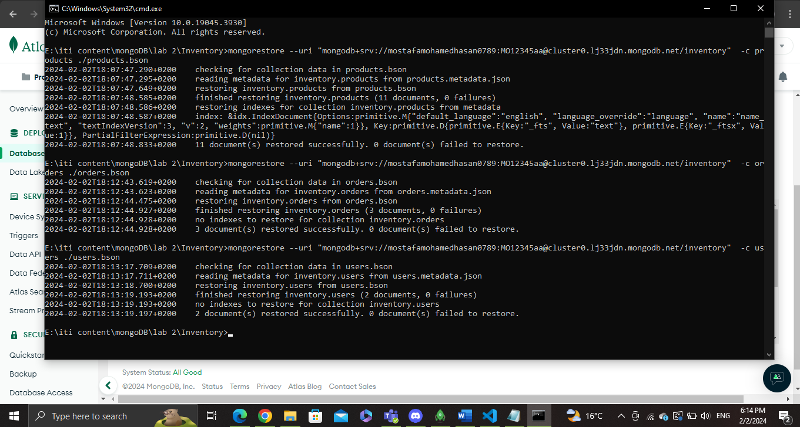
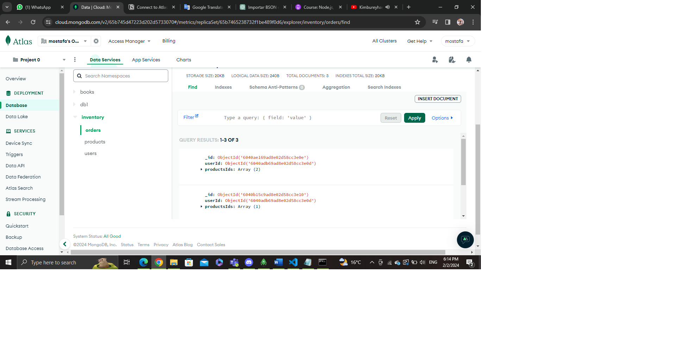
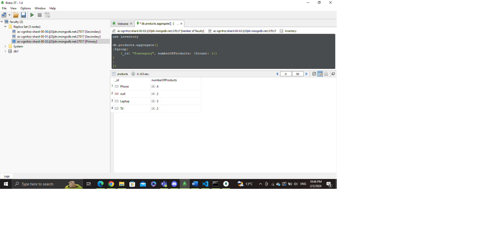
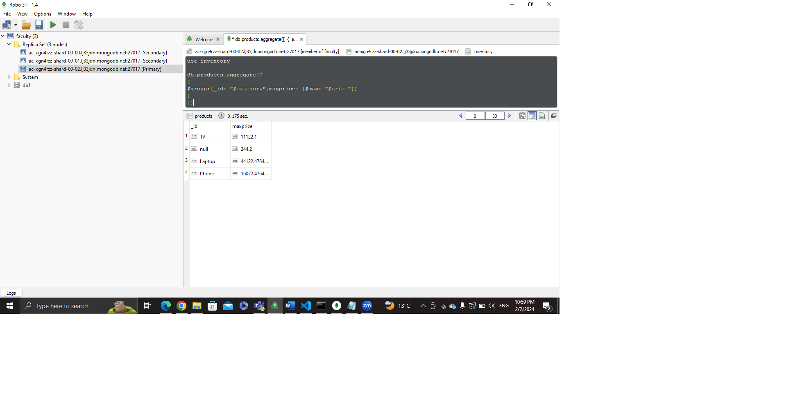
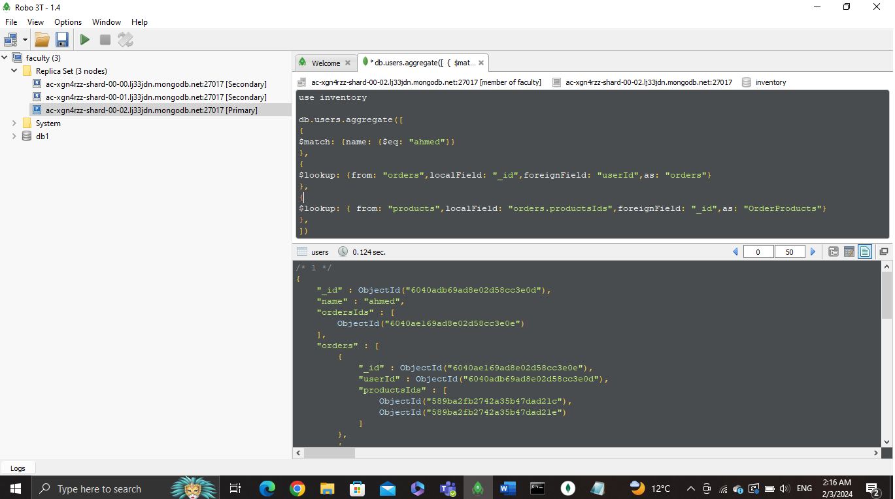
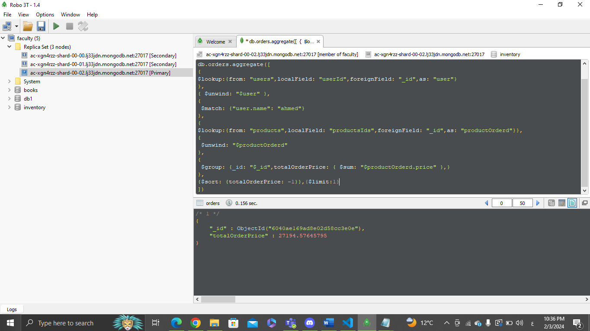
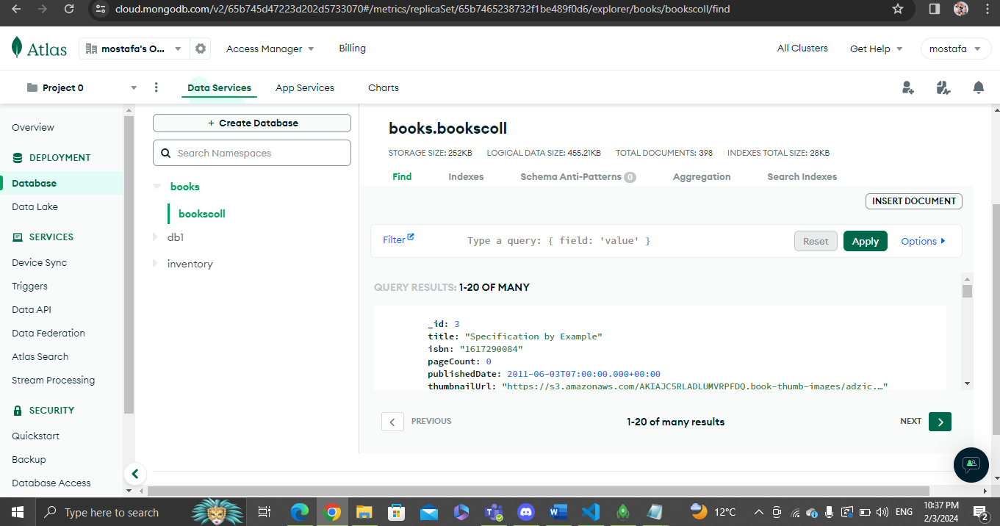

#Import inventory database 

#Display number of products per category 

#Display max category products price 

#Display user ahmed orders populated with product 

#Get user ahemd highest order price

#import books.json

